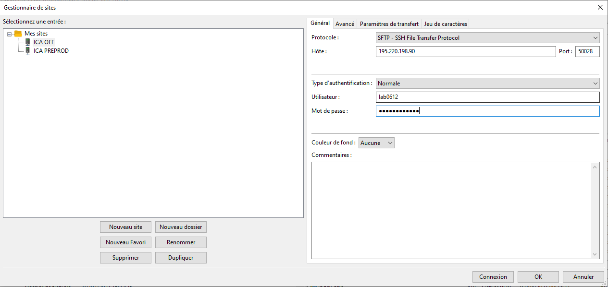

============
Installation
============

Installation de l'environnement de travail
==========================================

Pour travailler sur le site de l'institut clément ader il va falloir installer différents logiciels.
Pour commencer vous pouvez choisir un éditeur de code de votre choix, l'éditeur que nous utilisons est Visual Studio Code.

Il faudra ensuite différents logiciels que je vais vous présenter ci-dessous.

.. note::

    Il n'y a pas d'ordre pour l'installation des logiciels. L'ordre pour le lancement sera donné dans les explications.

.. important::
    Les différents identifiants : *utilisateur* et *mot de passe* ne seront pas donnés pour éviter que l'acces soit public et car il
    est possible que les identifiants changent.

FileZilla
=========

FileZilla Client est un client FTP, FTPS et SFTP, développé sous la licence publique générale GNU.
Avec ce logiciel vous pourrez gérer les fichiers du site ICA. Pour commencer vous pouvez télécharger FileZilla
sur le lien ici : `Télécharger FileZilla <https://filezilla-project.org/>`__
Il vous suffit de choisir **FileZilla Client** et de suivre l'installation.

Après installation lancez le logiciel et cliquez sur le bouton permettant d'ouvrir le gestionnaire de sites.

On va maintenant installer le serveur ICA OFF. Deux serveurs et sites sont diponibles : 
- Préprod ICA, qui vous permet de tester toutes vos modifications et d'avoir un site permettant de laisser le site ICA OFF disponible pour les utilisateurs
- Prod ICA, nommé ICA OFF sur FileZilla est le site officiel que tous les utilisateurs utilisent.

Voici l'affichage du gestionnaire de sites :

Pour vous connecter vous pouvez ajouter avec le bouton **Nouveau site** voici les informations
de connexion pour les deux sites.

ICA Prod :
----------

- Protocole : SFTP
- Hôte : 195.220.198.90
- Port : 50028
- Utilisateur : **Demander à un responsable**
- Mot de Passe : **Demander à un responsable**

ICA Préprod :
-------------

- Protocole : SFTP
- Hôte : 195.220.198.90
- Port : 50025
- Utilisateur : **Demander à un responsable**
- Mot de Passe : **Demander à un responsable**

Une fois ajouté vous pouvez vous connecter au serveur et vous retrouverez les fichiers du site.
Si on se connecte au site ICA Prod on retrouve :

.. image:: images/ChoixWWWFTP.png

Pour acceder aux dossiers il faut choisir **ica.cnrs.fr** ensuite **www** et enfin vous pouvez retrouver tous les fichiers les
du site ICA .

FortiClient VPN
===============

Pour l'installation du VPN de l'INSA vous avez un tutoriel sur le lien ci-contre : `Installation VPN <https://wiki.etud.insa-toulouse.fr/books/r%C3%A9seau-et-internet/page/sous-windows>`__

PhpMyAdmin
==========

Pour acceder aux base de donnée SQL via PhpMyAdmin nous avons deux liens avec différentes données de connexion.

ICA Prod :
----------

- Lien vers la page PhpMyAdmin : `PhpMyAdmin Prod <https://laboffice.lamp.core-clouds.fr/phpMyAdmin/>`__
- Utilisateur : **Demander à un responsable**
- Mot de passe : **Demander à un responsable**

ICA PréProd :
-------------

- Lien vers la page PhpMyAdmin : `PhpMyAdmin Prod <https://laboffice.lamp.core-clouds.fr/phpMyAdmin/>`__
- Utilisateur : **Demander à un responsable**
- Mot de passe : **Demander à un responsable**
