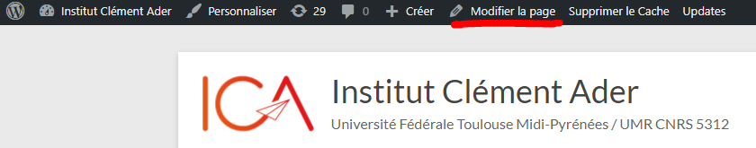

============
Introduction
============

Définition de la documentation
==============================

Cette documentation à pour but d'aider un développeur ne connaissant pas l'environnement de travail 
de l'Institut Clément Ader à pouvoir trouver des repères dans le code.

Vous trouverez ici l'aborescence du site : `Arborescence des fichiers <https://www.gloomaps.com/nVPbNqnqAl>`__

Le site est divisé en plusieurs partie pour faciliter la lisibilité.
Premièrement les pages se situent dans le dossier App.
Celui-ci contient les dossiers Public et Intranet que nous verrons plus tard.
De plus des fichiers se trouvent dans ce même dossier, ce sont des fichiers "globaux" qui seront utilisés 
dans la plus part des pages.

.. important::

   Certaines pages utilisées dans l'intranet peuvent aussi être utilisées dans la partie public. Il est donc important 
   de vérifier que les modifications ne cassent pas les deux pages.

Le dossier Public
-----------------

Le dossier public regroupe toutes les applications et fichiers de la partie publique du site. Ces pages 
ne nécéssitent pas une connexion au site ICA et sont disponibles pour tous.

Le dossier Intranet
-------------------

Le dossier Intranet regroupe toutes les applications et fichiers faisant partie de l'Intranet du site. Ces pages
nécéssitent une connexion pour y accéder et permettent la gestion des pages ouverte au public. Par exemple : La partie 
gestion des theses de l'Intranet permet de gerer les theses vues par le public sur le site ICA.

La gestion sur WordPress
========================

Les snippet 
-----------

Pour gérer les snippet appelés dans les pages wordPress il suffit d'aller dans la catégorie **XYZ PHP Code** dans la liste du menu WordPress.

Voici un lien pour aller directement sur la page des snippet : `Snippet WordPress <https://ica.cnrs.fr/wp-admin/admin.php?page=insert-php-code-snippet-manage>`__

Les pages
---------

Pour la gestion des pages nous pouvons soit cliquer sur le bouton **Modifier la page** représenté sur la page ci-dessous.

Tout comme pour les snippet on peut aussi retrouver les pages dans la liste du menu WordPress avec la catégorie **Pages**

Voici un lien pour aller directement sur la liste des pages. `Pages WordPress <https://ica.cnrs.fr/wp-admin/edit.php?post_type=page>`__

Les pods
--------

Pour les pods utilisés dans le code on peut aussi les retrouver la liste du menu WordPress avec la catégorie **Administration**

Les tableaux WordPress
----------------------